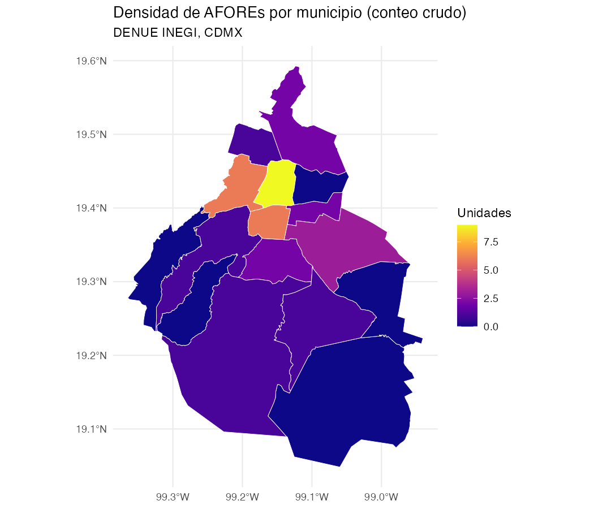
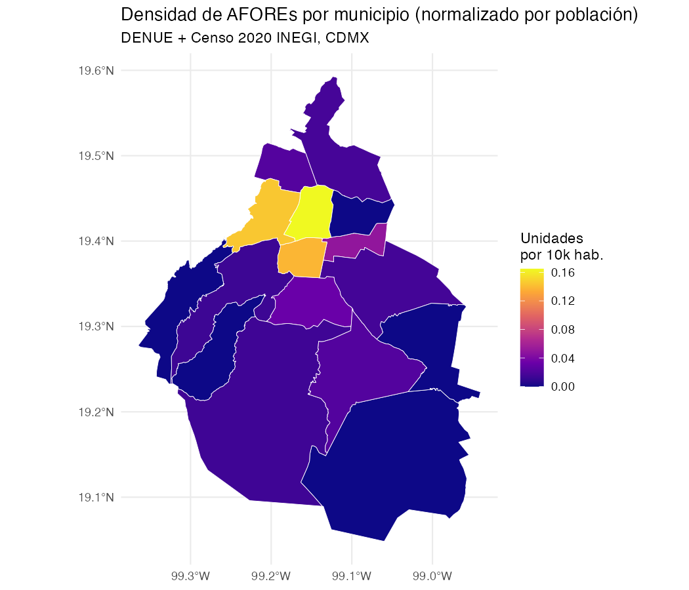

# 01 - Mapa Coroplético por Municipio (Opción A)

**Tarea:** Cruza tus puntos del DENUE con el shapefile de municipios de tu entidad (unión
espacial) y pinta un mapa de densidad por municipio.

**Requisito de rigor:** un conteo crudo por municipio casi siempre solo refleja qué municipio
tiene más población. Normaliza el conteo por población municipal (unidades por cada 10,000
habitantes) y genera ambos mapas (crudo y normalizado). Explica en qué municipio(s) cambia el
ranking al normalizar y por qué.

**Script base:** [`03_choropleth_municipio.R`](03_choropleth_municipio.R)

## Método

1. **Unión espacial:** los 34 puntos de AFORE filtrados en la Parte 1 (`denue_filtrado.csv`) se
   convierten a `sf` y se cruzan con el shapefile de los 16 municipios de Ciudad de México
   (`municipios_estado.shp`, Marco Geoestadístico 2020 INEGI) vía `st_join` — a cada sucursal se
   le asigna el municipio que la contiene.
2. **Conteo crudo:** se cuentan las sucursales por municipio (`n_unidades`).
3. **Normalización:** se une la población total por municipio (Censo de Población y Vivienda
   2020, INEGI, producto ITER — ver [`poblacion_municipio.csv`](poblacion_municipio.csv)) y se
   calcula `tasa_10k = (n_unidades / poblacion) * 10000`.

## Evidencia: conteo crudo vs. normalizado

| # | Municipio (crudo) | n | | # | Municipio (normalizado) | por 10k hab. |
|---|---|---|---|---|---|---|
| 1 | Cuauhtémoc | 9 | | 1 | Cuauhtémoc | 0.165 |
| 2 | Benito Juárez | 6 | | 2 | Miguel Hidalgo | 0.145 |
| 3 | Miguel Hidalgo | 6 | | 3 | Benito Juárez | 0.138 |
| 4 | Iztapalapa | 3 | | 4 | Iztacalco | 0.049 |
| 5 | Coyoacán | 2 | | 5 | Coyoacán | 0.033 |
| 6 | Gustavo A. Madero | 2 | | 6 | Azcapotzalco | 0.023 |
| 7 | Iztacalco | 2 | | 7 | Xochimilco | 0.023 |
| 8 | Azcapotzalco | 1 | | 8 | Gustavo A. Madero | 0.017 |
| 9 | Álvaro Obregón | 1 | | 9 | Iztapalapa | 0.016 |
| 10 | Tlalpan | 1 | | 10 | Tlalpan | 0.014 |
| 11 | Xochimilco | 1 | | 11 | Álvaro Obregón | 0.013 |
| — | Cuajimalpa, La Magdalena Contreras, Milpa Alta, Tláhuac, Venustiano Carranza | 0 | | — | (mismos, 0) | 0.000 |

Cifras control: 34/34 sucursales asignadas a un municipio (0 sin cruce espacial), 16/16
municipios con población enlazada (0 `NA` en el `left_join`).

### Mapas

| Conteo crudo | Normalizado (por 10,000 hab.) |
|---|---|
|  |  |

## Interpretación: ¿dónde cambia el ranking y por qué?

- **Iztapalapa cae del #4 (crudo) al #9 (normalizado).** Es, por mucho, el municipio más poblado
  de la ciudad (1.84 millones de habitantes), así que sus 3 sucursales son insuficientes al dividir
  entre una base poblacional enorme — tiene oferta de AFORE, pero muy por debajo de lo que su
  población demandaría proporcionalmente. 
  ** Profuturo tiene un nueva sucursal en Iztapalapa pero aún no está reflejada en los datos.** Lo cual cambiaría el ranking normalizado si se incluyera.
- **Gustavo A. Madero cae del #6 al #8** por la misma razón: 1.17 millones de habitantes para
  solo 2 sucursales.
- **Iztacalco sube del #7 (crudo) al #4 (normalizado).** Con apenas 2 sucursales pero una
  población relativamente chica (404 mil), su tasa por cada 10,000 habitantes resulta más alta
  que la de municipios con más sucursales en términos absolutos.
- **Azcapotzalco y Xochimilco suben (#8→#6 y #11→#7)** por el mismo efecto: pocas sucursales,
  pero también poca población, lo que eleva su tasa relativa.
- **Miguel Hidalgo y Benito Juárez intercambian el #2 y #3**, a pesar de tener el mismo conteo
  crudo (6 sucursales cada uno): Miguel Hidalgo tiene ligeramente menos población (414 mil vs.
  434 mil), así que su tasa normalizada resulta mayor.
- **Cuauhtémoc se mantiene en el #1 en ambos rankings** — no es casualidad: es el municipio con
  más sucursales en términos absolutos *y* uno de los menos poblados de la ciudad, por lo que
  concentra la mayor densidad de oferta de AFORE bajo cualquier métrica.

**Conclusión:** el conteo crudo sobreestima la cobertura real en municipios muy poblados
(Iztapalapa, Gustavo A. Madero) y subestima la de municipios chicos con alguna sucursal
(Iztacalco, Azcapotzalco, Xochimilco). El mapa normalizado es el que debería usarse para decidir
dónde abrir una nueva sucursal por demanda potencial no cubierta.

** La decisión que podría tomarse a partir de este análisis es abrir nuevas sucursales en municipios con alta demanda potencial no cubierta, según el mapa normalizado.**
